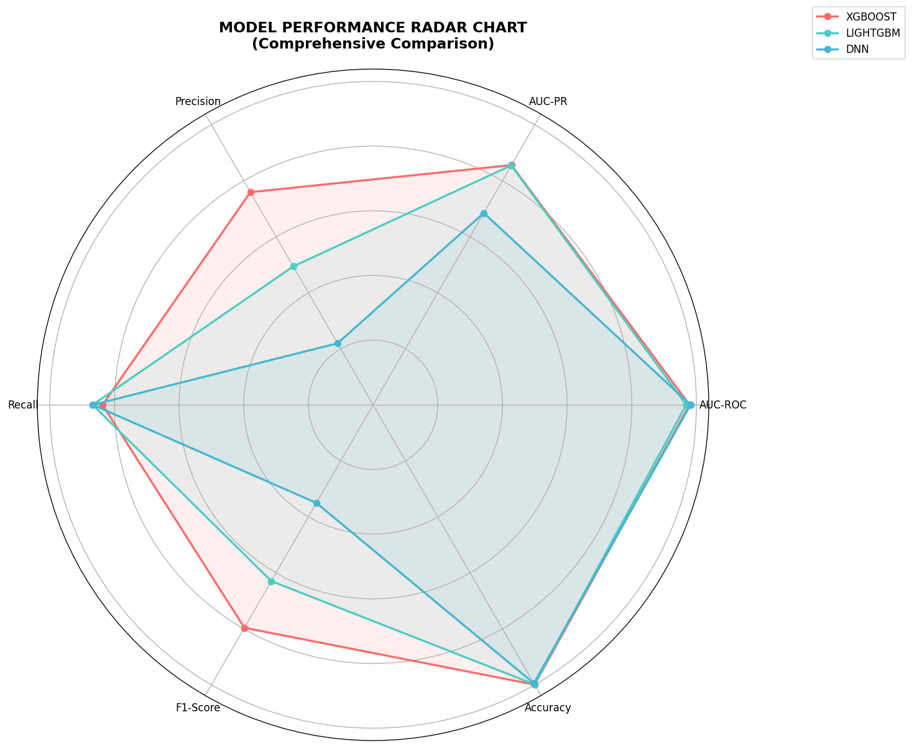
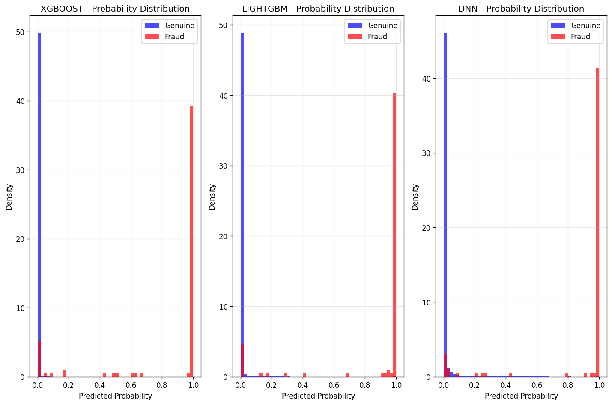

# Credit Card Fraud Detection ML model
Complete machine learning project for credit card fraud detection with advanced handling of extreme class imbalance (0.17% fraud rate). Includes full code, notebooks, and comprehensive evaluation.
Estimate and Prediction of credit card fraud rates with 97.89% ROC and 99% accuracy. 

# Contents
* src/utilities.py - Main utility classes for model training and evaluation

* notebooks/ - Jupyter notebooks with complete analysis

* reports/ - Generated visualizations and performance metrics

* requirements.txt - Python dependencies

# Key Features

* Multiple ML models (XGBoost, LightGBM, DNN, Random Forest, SVM)

* Advanced hyperparameter optimization with Optuna

* Comprehensive evaluation metrics and visualizations

* GPU-accelerated training

* Professional reporting system

# Usage

* Add [Credit Card Fraud Detection](https://www.kaggle.com/datasets/mlg-ulb/creditcardfraud) dataset to your Kaggle notebook

* Install requirements: !pip install -r requirements.txt

* Run the analysis notebook

# 📊 Quick Performance Summary:  

| Model    | AUC-ROC | AUC-PR | F1     | Precision | Recall  | Accuracy |
|----------|---------|--------|--------|-----------|---------|----------|
| XGBOOST  | 0.9789  | 0.8560 | 0.7593 | 0.8367    | 0.7961  | 0.9993   |
| LIGHTGBM | 0.9687  | 0.8550 | 0.4942 | 0.8673    | 0.6296  | 0.9982   |
| DNN      | 0.9820  | 0.6849 | 0.2196 | 0.8673    | 0.3505  | 0.9945   |

Overall, the results show that XGBoost delivers the most balanced and reliable performance for fraud detection, achieving the highest F1 score and strong precision-recall tradeoff, making it the best choice for identifying fraudulent transactions. LightGBM performs competitively in terms of AUC and precision, but its lower recall means it misses more fraud cases, which could be costly in practice. The DNN model, while achieving the highest AUC-ROC, struggles with precision-recall and F1, highlighting that ROC alone can be misleading in highly imbalanced datasets. These findings emphasize the importance of evaluating models with metrics beyond accuracy, particularly precision, recall, and F1, when working with fraud detection problems.

## Probability Distribution from the output of ML models

